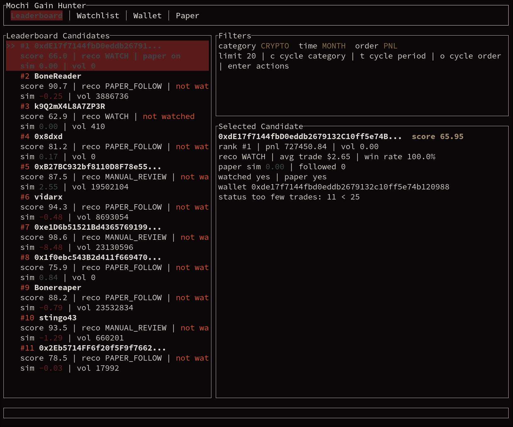
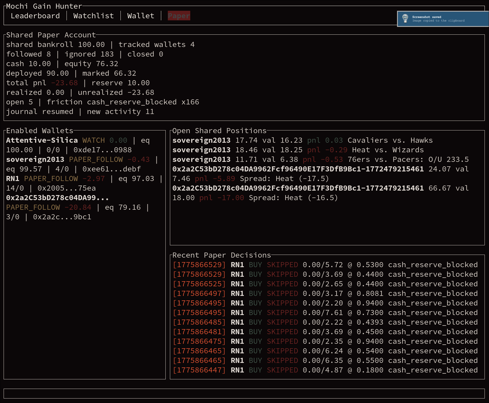

# Mochi Gain Hunter

Rust TUI for researching Polymarket wallets, tracking candidates, and testing copy-trading ideas with a shared paper account.

## What it does

- discovers candidate wallets from public Polymarket data
- tracks a watchlist and recent wallet activity
- inspects wallet details and trades
- runs shared paper-follow simulation across enabled wallets
- supports a headless `service` mode for longer-running use

## Screenshots

<table>
  <tr>
    <td align="center" width="50%"></td>
    <td align="center" width="50%"></td>
  </tr>
</table>

## Run

```bash
cargo run
```

## Main tabs

- `Leaderboard` — public wallet discovery
- `Watchlist` — saved wallets and recent trades
- `Wallet` — detailed wallet inspection
- `Paper` — shared paper account across enabled wallets

## Useful controls

- `Tab` / `Shift+Tab` or `h` / `l` — switch tabs
- `j` / `k` or arrows — move selection
- `Enter` — open wallet actions
- `i` — inspect selected wallet
- `a` — add selected wallet to watchlist
- `p` — toggle paper-follow
- `d` — remove wallet from watchlist
- `c` / `t` / `o` — cycle leaderboard filters
- `r` — refresh
- `q` — quit

## Other commands

```bash
cargo run -- init-config
cargo run -- discover --category OVERALL --time-period MONTH --order-by PNL --limit 10
cargo run -- inspect-wallet 0x0123456789abcdef0123456789abcdef01234567
cargo run -- simulate-follow 0x0123456789abcdef0123456789abcdef01234567
cargo run -- service --once
cargo run -- service
```

## Notes

- paper mode uses one shared bankroll across enabled wallets
- the project uses public Polymarket endpoints
- live orders are not submitted yet

## License

MIT
